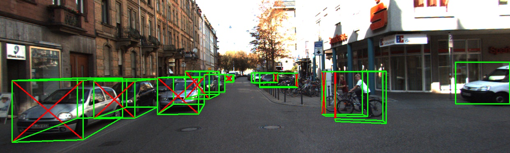
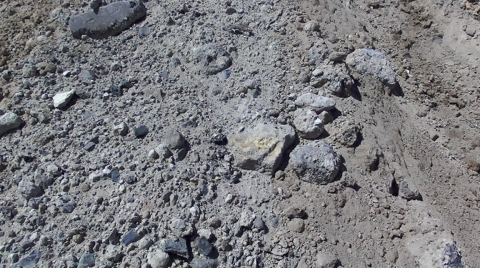
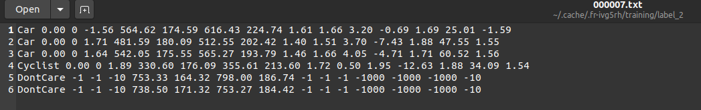
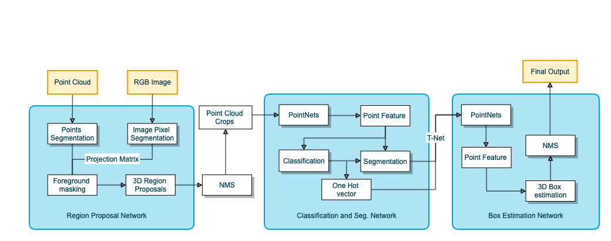
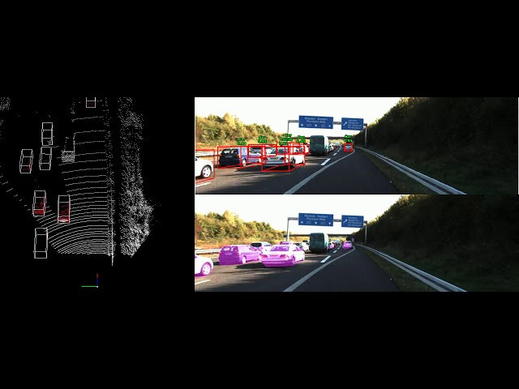

# Master Thesis

The topic of object detection in off-road domain has been fascinating for me since I did my project using Mask-RCNN. To further coninue in this field, I decided to  do my Master thesis in the same topic. 

# Topic summary 

1. The ultimate aim of the work is to have the 3D structure of the stone for further processing. Currently, with the help of Mask-RCNN, I am able to detect rocks in the images and subsequently draw the 2D bounding boxes.

2. 2D bounding boxes are capable of providing the location of the object. To further get the 3D shape of the object, depth information is required. To get this depth, we usually use laser scans (LIDAR) or stereo cameras. 

3. Once we have the 3D properties of the object, it is possible to draw 3D bounding box around the object. This bounding box can be utilized for further processing. 

4. After we are able to identify the 3D bounding boxes, various tests including Playback, Real world tests would finally conclude the thesis.

# Challenges

1. There are many approaches or architectures that have the capacity of drawing 3D bounding boxes around the object of interest. All of these architectures have similarities in the sense of Dataset.

2. Almost all of them use KITTI dataset in which the objects are distinctly visible in the environment and have a significant structure (3D size). It is therefore, possible to construct 3D bounding boxes using some architectures. 

3. The environment in which we are focussing is an ambiguous environment:
    1. The whole idea of a 3D bounding box is to get the orientation and size of the object. To get the orientation in (let's say) cars, we draw a starting 2D bounding box, calculate the centre of the box and extend it towards its orientation angle throughout its depth. In other words, while labelling the dataset, the pose (front, back, side) was also taken into consideration.

           

    2. Rocks don't have a fixed orientation and enormous size and therefore, it is a topic of discussion as to why and how having a 3D bounding box would help us in this case.

        
    
    3. Along-with this, the dataset that we have isn't a very promising one. Generally LIDAR scans in our dataset would not be able to capture the true properties of the rocks as compared to the traditional LIDAR scans in an urban environment. 

## Dataset Richness
As we all know, the key to a good detection is having a rich dataset. 
1. To create a dataset with RGB images is comparatively easier. We have many annotators present and since we dont have to deal with depth, the annotation process is straightforward. 

2. To create a dataset with Point cloud is a tedious task. If we have a normal urban city environment in which we have to annotate cars, pedestrian, etc it is still doable. 

3. The Point cloud annotation of rocks in our enviornment is a very challenging task. It would be very hard to detect and differentiate rocks in the point cloud and then annotating them.

4. This alone would again take huge amount of time. I looked at the currently present Point cloud labelling tools such as  MeshLab (https://www.meshlab.net/) and CLoudCompare (http://www.cloudcompare.org/). But it seems just getting familiar with the tool would take much time.

## KITTI Dataset

Since almost all the architectures available base their work on the labels and ground truth available in the KITTI dataset, it becomes important to discuss the format and the components of the KITTI labels. 

Even if we decide to annotate our point cloud to work with these architectures, we have to see whether our labels conform with the KITTI labels format and therefore with the architectures.

 

1. Type - Describes the type of object: 'Car', 'Van','Truck','Pedestrian', 'Person_sitting', 'Cyclist', 'Tram','Misc' or 'DontCare'.

2. Truncated - Float from 0 (non-truncated) to 1 (truncated), where truncated refers to the object leaving image boundaries.

3. Occluded - Integer (0,1,2,3) indicating occlusion state: 0 = fully visible, 1 = partly occluded
2 = largely occluded, 3 = unknown.

4. Alpha - Observation angle of object, ranging [-pi....pi].

5. (4 Pamaters) bbox - 2D bounding box of object in the image (0-based index):contains left, top, right, bottom pixel coordinates.

6.  3    dimensions - 3D object dimensions: height, width, length (in meters).

7.   3    location - 3D object location x,y,z in camera coordinates (in meters).

8.   1    rotation_y - Rotation ry around Y-axis in camera coordinates [-pi..pi].

9.   1    score - Only for results: Float, indicating confidence in detection, needed for p/r curves, higher is better.
---------------------

# Approaches

## 1. Utilizing a Point cloud architecure

1. One approach to draw a 3D bounding box is to use a point cloud architecture such as PointRCNN (https://arxiv.org/abs/1812.04244).

2. To continue with this approach, the dataset had to be drawn from scratch. The detection results from RGB images (Mask RCNN) would not be used.

3. ## Challenges
    1. Creating a dataset is very time consuming and is probably not feasible.

    2. Processing of Raw Point cloud would be a highly computationally expensive task and therefore not feasible.

## 2. Sensor fusion (PointRCNN with RGB Images)

1. The other approach is to use Point cloud in amalgamation with RGB images. While researching about this approach, I found an architecture (https://github.com/JenningsL/PointRCNN) which utilizes PointRCNN with images to output the 3D bounding box. 

    

    

 2. ### Challenges
    1. To work with this network, the Point cloud dataset has to be made in conformance with the KITTI labels. 
    
    2. Could be a computationally expensive network.

## 3. Mapping of Image points on Point cloud

1. After looking at the above prospectus of drawing a 3D bounding box, we find that one of the main challenges while working with these networks is the availabiltiy of rich dataset conforming with KITTI labels.

2. There could be a better way in which we don't utilize the point cloud during training and simply map the 2D bounding boxes (obtained from Mask RCNN) in the point cloud. 

3. When we are using traditional Point cloud architectures such as Point Net, etc, the whole scene is processed to find out the interest points and then detection is done. 

4. Labelling the points in a laser point cloud is a very challenging task because the size of stones is comparatively very small. So when we are looking at a point cloud, it becomes very hard to see which points make up a stone.

5. My proposed approach is to detect the interest points in RGB images and map them in the Point cloud. In this way, we would have the potential candidates which can be used for further processing. With this approach, the processing of whole scene of point cloud would be narrowed down to processing of only the mapped points. 

6. Further, if somebody (in future) decides to label the point cloud, he atleast would have a starting point. Also, when labelling, if some stones are left undetected, the user can visualize in the image and simultaneously (taking a reference) label them in the point cloud.

7. As to drawing the 3D bounding boxes, there would be no point cloud behind the stone, therefore, the making of a 3D bounding box is still to be discussed.

8. ### Requirements:
    1. To do this, we need the extrinsic parameters and camera calibration matrices.

 